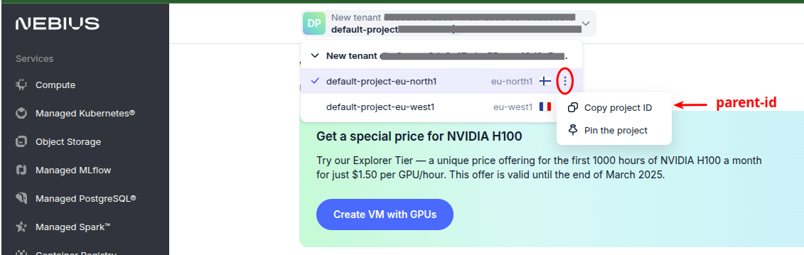

# nebius-project

#### Prerequsites

- Setup your [billing account](https://docs.nebius.com/signup-billing/sign-up)

- To have [Nebius CLI](https://docs.nebius.com/cli/install) already installed 

Note: this procedure has been tested with CLI version *0.12.36*

```bash
$ nebius version
```
```text
0.12.36
```

#### Create profile
- check that there is an existing profile

```bash
$ nebius profile list
 ```
```text
Error: missing configuration: open /home/user/.nebius/config.yaml: no such file or directory
To configure nebius, run:
	$ nebius profile create
```

- creating [profile](https://docs.nebius.com/cli/reference/profile/create)

Notes: 
- Choose the defaults for this lab, and particularly choose "Federation" if setting up Nebius CLI for personal interactive use.
- An alias "nb" has been created, which points to the "nebius" command.

```bash
$ nb profile create sandbox
```
```text
Set api endpoint: api.eu.nebius.cloud
✔ federation
Set federation endpoint: auth.eu.nebius.com
profile "sandbox" configured and activated
```

- test (sandbox) profile
```bash
$ nb profile list
```
```text
sandbox [default]
```
- associate local profile with parent-id (a.k.a project id)
```bash
$ nb config set parent-id project-< .......... >
```

Where to find parent-id?



- check the profile configuration
```bash
$ nb config list
```

----

### Resource Manager to list specific resource types

#### List service accounts
```bash
$ nb iam service-account list --format json | jq -r .items[].metadata.id
```

#### List available hardware options for new VMs
```
$ nb compute platform list
```

#### List regions
```bash
$ nb iam tenant list --format json | jq -r '
  .items[] | [.metadata.id, .metadata.name, .status.region] | @tsv'
```

or in a table format

```bash
$ {
  echo -e "ID\tNAME\tREGION"
  nb iam tenant list --format json | jq -r '
    .items[] | [.metadata.id, .metadata.name, .status.region] | @tsv'
} | column -t -s $'\t'
```

helpful

```bash
$ nb iam tenant list --format json | jq -r '
  .items[] | [.metadata.id, .metadata.parent_id, .metadata.name, .status.region]'
```

```bash
$ nb iam tenant list --format json | jq '[.items[] | {id: .metadata.id, parent_id: .metadata.parent_id, container_state: .status.container_state}]'
```

#### List all disks
```
$ nb compute disk list
```

#### List GPU clusters
```
$ nb compute gpu-cluster list
```

#### List vpc pool
```
$ nb vpc pool list
```

#### List buckets (Object Storage)
```
$ nb storage bucket list
```

#### List vpc subnets
```bash
$ nb vpc subnet list
```

#### List network_id
```
$ nb vpc subnet list --format json| jq -r '.[].[].spec.network_id'
```

#### List kubernetes clusters
```
$ nb applications v1alpha1 k-8-s-release
```

===

#### Create service account
- Creating service account
```bash
$ nb iam service-account create \
  --name terraform-sa --format json
```
- Find tenant IDs

Where to find parent-id?


or

```bash
$ nb iam whoami --format json | jq -r ".user_profile.tenants[].tenant_id"
```

- Getting group *editors* ID
```bash
$ nb iam group get-by-name --name editors \
  --parent-id < tenant_id > --format json | jq -r ".metadata.id"
```

- Associating the service account to the *editors* group
```bash
$ nb iam group-membership create \
  --parent-id $NB_EDITORS_GROUP_ID \
  --member-id $NB_SA_ID
```
#### Create public key and service account association
- Load existing key to the enviroment (Option 1)
```bash
$ export NB_AUTHKEY_PUBLIC_PATH="~/.ssh/id_rsa.pub"
```
- Association key
```bash
$ nb iam auth-public-key create \
 --account-service-account-id < NB_SA_ID > \
 --data "$(cat $NB_AUTHKEY_PUBLIC_PATH)"
```
- Create a brand new key (Option 2)
```bash
$ export NB_AUTHKEY_PRIVATE_PATH=~/.ssh/nebius-private.pem
```
```bash
$ export NB_AUTHKEY_PUBLIC_PATH=~/.ssh/nebius-public.pem
```
```bash
$ openssl genrsa -out $NB_AUTHKEY_PRIVATE_PATH 4096
```
```bash
$ openssl rsa -in $NB_AUTHKEY_PRIVATE_PATH \
  -outform PEM -pubout -out $NB_AUTHKEY_PUBLIC_PATH
```
- Association key
```bash
$ nb iam auth-public-key create \
 --account-service-account-id < NB_SA_ID > \
 --data "$(cat $NB_AUTHKEY_PUBLIC_PATH)"
```
===
#### List ssh keys
- List keys 
```bash
$ nb iam auth-public-key list
```

===
#### List k8s clusters
```bash
$ nb nebius mk8s v1 cluster list
```

#### Get external credentials
```bash
$ nb mk8s v1 cluster get-credentials --id mk8scluster-e00t2jap...... --external
```
===